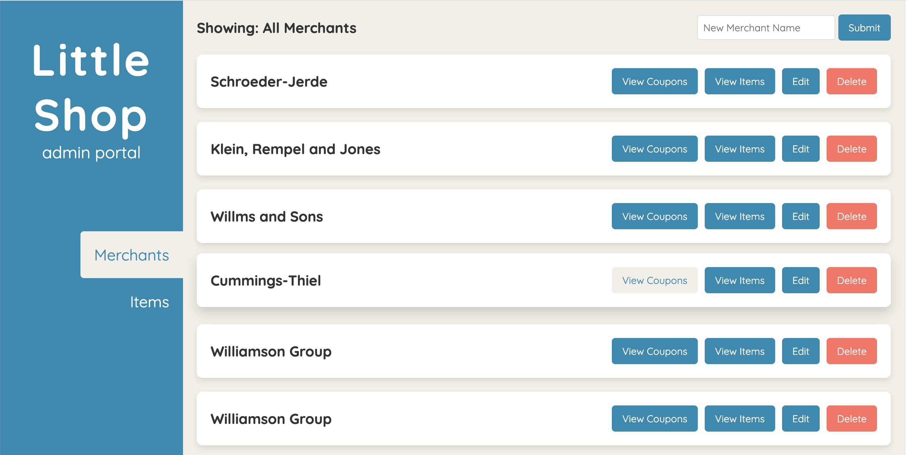
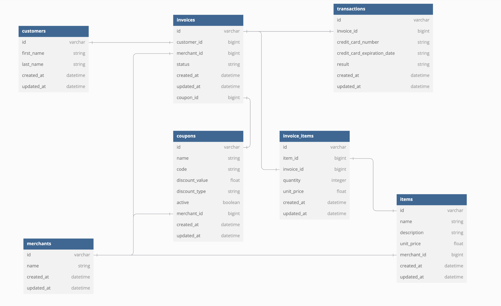

# Little Shop - Coupon Codes | Final Project | Frontend Starter Repo

This Vite Little Shop - Coupon Codes FE Final Project Boilerplate is built to consume and display the data from the BE Rails API built in the Mod 2 Final Project.    

Project By Terra Manning 
https://github.com/TDManning 
https://www.linkedin.com/in/terra-manning/ 

### Learning Goals:
1. Write migrations to create tables and relationships between tables
2. Implement CRUD functionality for a resource
3. Use MVC to organize code effectively, limiting the amount of logic included in serializers and controllers
4. Use built-in ActiveRecord methods to join tables of data, make calculations, and group data based on one or more attributes
5. Write model tests that fully cover the data logic of the application
6. Write request tests that fully cover the functionality of the application
7. Display data for users in a frontend application by targeting DOM elements

### Set Up Instructions

**Note:** Do **not** clone this repo into your backend repo. Put it somewhere else as a stand alone. The BE and FE repos will remain two separate repos and you will submit the links to each.  

1. Fork repo
2. Clone forked repo and rename it `git clone <repo> <new name>`
3. `cd` into cloned repo
4. Run `npm install`
5. Run `npm run dev` to start developing.
6. You'll see in the terminal that the project has opened at "http://localhost:5173/"

## Set Up Notes

This FE application is build to consume the data from your Rails API.  In order for it to work, you must have your Rails API running on localhost:3000. You will see fetch errors when running the FE without the BE API up and running.  

### Preview of App:

### Context:
In under one week, students were given the task of creating a fully working "Little Shop" website with a rails API application. Working from of the Little Shop API group project we created a coupon table to go along with the six previously created tables. We were then given a starter repo for the front end and made some CSS adjustments and javascript refactors in order to correctly display our API content. 

### Wins + Challenges:

Challenges 
1. Navigating API Requests and Responses: One of the recurring challenges was handling data fetching from my Rails API, especially when trying to fetch coupons for a specific merchant. I encountered issues like 404 errors, understanding nested routes, and handling cases where no data was returned.
2. Error Handling and Edge Cases: Ensuring that my app provided meaningful feedback to users when things went wrong (e.g., no coupons available, failed API fetches) was another challenge. Implementing robust error handling in both the frontend and backend was necessary but required careful testing to ensure it worked as expected.

Wins 
1. This project showcased my growth as a developer. I demonstrated an ability to think critically, debug effectively, and break down complex problems in to smaller, more manageable pieces. More importantly, I consistently sought to understand why something wasn't working rather than just finding a quick fix.

